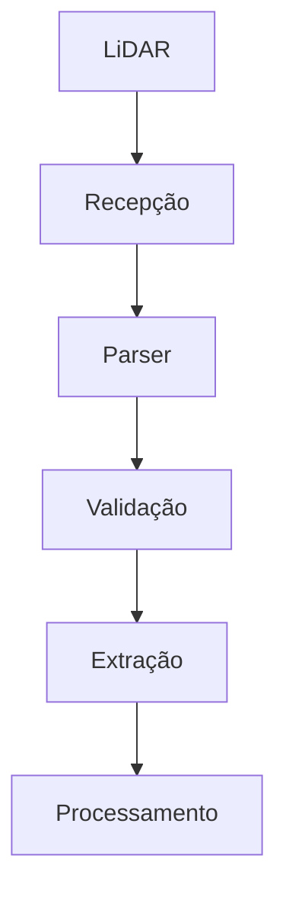
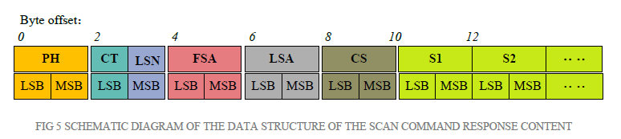
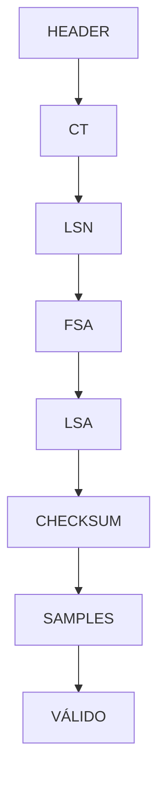

# LIDAR

Firmware desenvolvido para **aquisição, interpretação e validação** do sensor LiDAR X2 da YD LiDAR, como etapa de desenvolvimento anterior à integração do sistema de sensoriamento do robô *Teiú*

O projeto teve como objetivo principal compreender o protocolo de comunicação do sensor, estruturar a recepção dos dados e desenvolver um mecanismo capaz de identificar, validar e interpretar os pacotes transmitidos pelo LiDAR.

Além da validação da comunicação, este projeto serviu como base para o desenvolvimento do processamento das medições de distância posteriormente incorporado ao firmware principal do Teiú.

---

## Objetivos

O desenvolvimento foi conduzido com os seguinte objetivos:

- Estabelecer a comunicação entre o microcontrolador STM32F446RE e o LiDAR X2;
- Analisar a estrutura de dados transmitida pelo sensor;
- Identificar os campos presentes nos pacotes;
- Desenvolver um parser para interpretação dos dados recebidos;
- Validar a integridade e a sequência dos campos do protocolo;
- Extrair as informações de distância das amostras recebidas;
- Verificar a consistência das medições obtidas;
- Avaliar o comportamento da aquisição de dados antes da integração ao sistema principal

---

## Comunicação

A comunicação com o sensor é realizada por meio da interface **UART**.

O LiDAR transmite continuamente seus dados, organizando as medições em pacotes. Cada pacote contém as informações de controle e um conjunto de amostras de distância.

De forma simplificada, o fluxo de processamento pode ser representado como:

---

## Estrutura dos pacotes

Durante o desenvolvimento foi reliazdas a análise da estrutura dos pacotes transmitidos pelo LiDAR.

O parser foi organizado de maneira incremental, permitindo que os bytes recebidos fossem interpretados de acordo com as respectivas posições dentro do pacote.

A sequência de processamento considera os campos:
| Campo       | Função                                     |
| ----------- | ------------------------------------------ |
| Header      | Identificação do início do pacote          |
| CT          | Campo de controle                          |
| LSN         | Quantidade de amostras presentes no pacote |
| FSA         | Ângulo da primeira amostra                 |
| Sample Data | Dados de distância das amostras            |
| LSA         | Ângulo da última amostra                   |
| CS          | Checksum do pacote                         |

Junto disso, foi usado o [Manual de Desenvolvimento do LiDAR X2](Docs/YDLIDAR%20X2%20Development%20Manual%20V1.2(211228).pdf). Nele temos todas as informações pertinentes ao pacote de dados, inclusive sua estrutura, como pode ser visto abaixo:

---

## Parser

Para evitar que o fluxo serial fosse tratado apenas como uma sequência de bytes sem contexto, foi desenvolvido um parser baseado em estados.

A recepção dos dados ocorre de forma sequencial e cada byte recebido é interpretado de acordo com o estado atual do parser.
Uma representação simplificada do processo é:

Essa abordagem permite separar a aquisição dos dados da interpretação do protocolo e facilita a identificação de erros durante a recepção.

Sendo que, toda a vez que um byte inválido é recebido, o parser é resetado para o primeiro estado, esperando um HEADER válido.

---

## Validação

A implementação permitiu validar cada etapa da comunicação.

Foram verificadas:

- Recepção correta dos bytes;
- Identificação do início dos pacotes (De acordo com as definição do Manual de Desenvolvimento);
- Interpretação dos campos de controle;
- Quantidade de amostras recebidas;
- Processamento das informações angulares;
- Extração das distâncas (Por meio de cálculos pré-definidos, também no Manual de Desenvolvimento);
- Verificação do checksum.

---

## Desenvolvimento

O projeto foi utilizado como ambiente de desenvolvimento e experimentação para o subsistema do LiDAR.

A separação do sensor em um firmware independente permitiu trabalhar especificamente na comunicação e no protocolo, sem a interferência dos demais subsistemas no robô.

---

## Relação com o projeto Teiú

Este projeto representa uma etapa independente do desenvolvimento do sistema de sensoriamento do Teiú.

A implementação desenvolvida aqui serviu como base para a posterior integração com o firmware principal, onde o sensor passou a fazer parte da arquitetura de aquisição e processamento de obstáculos do robô.

No Teiú, o processamento do LiDAR é integrado aos demais subsistemas responsáveis por percepção, navegação e segurança.

As decições relacionadas à integração com o restante do robô, incluindo arquitetura de tarefas, gerenciamento de recursos, integração e interação com os demais sensores, são documentos no repositório principal do Teiú.

---

## Tecnologias

* **C**
* **STM32**
* **UART**
* **DMA**
* **Parser baseado em máquina de estados**
* **Processamento de pacotes**
* **Aquisição de dados de distância**

---

## Projeto principal

A implementação integrada ao sistema completado do robô está disponível no projeto:

**Teiú - Mobile Robot**

Este repositório deve ser entendido como a etapa de **desenvolvimento e validação do subsistema LiDAR**, enquanto o repositório principal documenta sua utilização dentro da arquitetura completa do robô

---

## Contexto

Este projeto integra o desenvolvimento do robô móvel **Teiú**, desenvolvido como um projeto de engenharia/TCC.

